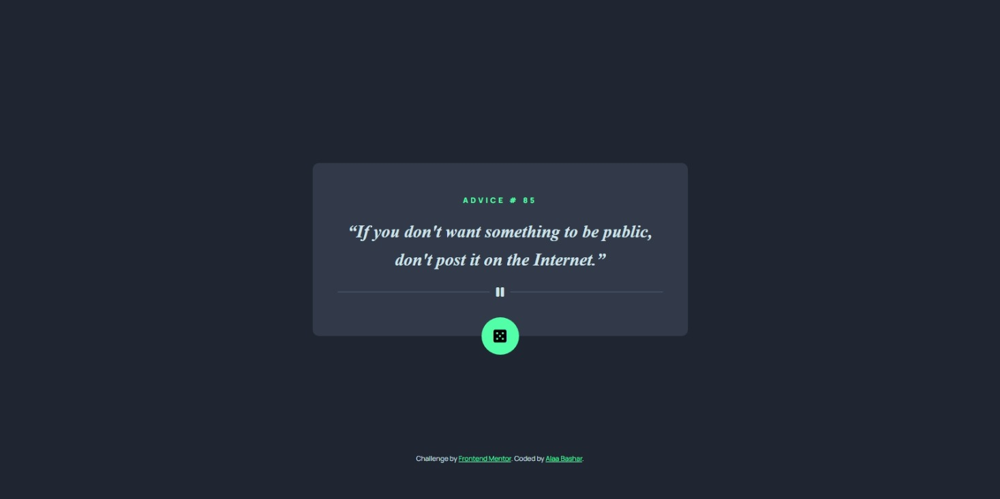
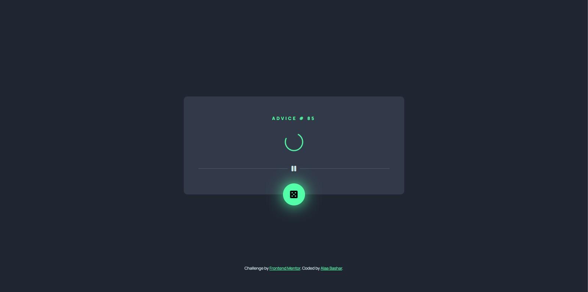
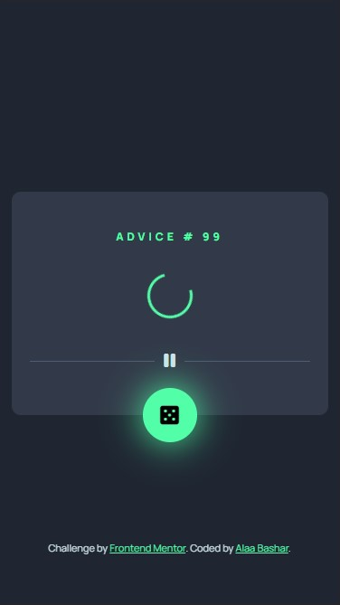

# Advice-generator-app-HTML-CSS-JS-API

<h3>An app that generates random advices...</h3>

<h4>Mainly this idea is referenced from <a href="https://www.frontendmentor.io/challenges/advice-generator-app-QdUG-13db">Frontend Mentor</a>, but i have made some changes:</h4>
<ol>
  <li>Changed the Advice font to be more formal to add more emphasis.</li>
  <li>
    Added a loading effect directly before showing the new generated advice, And that is for two reasons:
    <ul>
      <li>Adding more realistic experience to the user.</li>
      <li>The API request takes 1 sec so that loading effect prevents the user from fast-repeated requests.</li>
    </ul>
  </li>
</ol>

<h3>Technologies Used:</h3>
<ol>
  <li>HTML</li>
  <li>CSS</li>
  <li>JS</li>
  <li>API</li>
</ol>

<h3>Live Preview through this [<a href="https://advice-generator-app-html-css-js-api-yux6.vercel.app/">link</a>].</h3>

 

<h3>Desktop Preview:</h3>

 

<h3>Mobile Preview:</h3>

  
  

